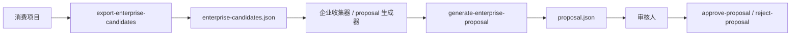

# 对话挖掘命令契约与目录协议

> 版本：1.2.0  
> 日期：2026-03-13  
> 关联文档：
> - `conversation-miner-skill-design-1.1.0.md`
> - `conversation-miner-skill-design-1.2.0.md`
> - `conversation-miner-skill-implementation-plan-1.2.0.md`

---

## 1. 文档目标

这份文档只做一件事：

把企业级沉淀链路里最关键的 3 个命令先定成稳定契约，避免后面一边写代码一边改协议。

这 3 个命令是：

1. `export-enterprise-candidates`
2. `generate-enterprise-proposal`
3. `approve-proposal`

文档内容包括：

- 每个命令的职责
- 输入输出
- schema 建议
- 目录协议
- 哪个仓库负责实现

---

## 2. 三个命令的角色



说明：

- `export-enterprise-candidates` 发生在消费项目侧
- `generate-enterprise-proposal` 发生在企业收集/治理侧
- `approve-proposal` 发生在审核侧

---

## 3. 仓库职责边界

## 3.1 消费项目侧

负责：

- 产出 `.power-ai/conversations`
- 产出 `.power-ai/patterns/project-patterns.json`
- 产出 `.power-ai/skills/project-local/auto-generated`
- 执行 `export-enterprise-candidates`

不负责：

- 企业级 proposal 审核
- 企业级 skill 集成
- 企业级发版

## 3.2 `power-ai-skills` 主仓

负责：

- 企业级 skill 集成
- `entry-skill` 路由补充
- manifest / changelog / release notes
- 发版与私仓发布

不建议直接负责：

- 周期性扫描多个消费项目
- 审核通知派发编排

## 3.3 企业自动化编排层

建议独立存在，职责是：

- 收集多个项目的候选包
- 生成 enterprise proposal
- 发送通知
- 接收审核动作
- 调用 `power-ai-skills` 命令完成集成与发版

这个编排层可以是：

- OpenClaw
- GitHub Actions / Jenkins
- 企业内部自动化平台

---

## 4. 目录协议

## 4.1 消费项目目录

```text
.power-ai/
  conversations/
  patterns/
    project-patterns.json
  reports/
    enterprise-candidates.json
  skills/
    project-local/
      auto-generated/
```

## 4.2 企业自动化工作区目录

```text
enterprise/
  inbox/
    <project-name>/
      enterprise-candidates.json
  proposals/
    proposal_20260313_001.json
  notifications/
    2026-03-13.json
  reviews/
    review-log.json
  config/
    notification-config.json
    evaluator-config.json
```

## 4.3 `power-ai-skills` 主仓目录

继续沿用现有结构，不新增 proposal 持久层事实源。  
提案批准后，回流到主仓的内容仍然是：

```text
skills/
docs/
manifest/
CHANGELOG.md
package.json
```

也就是说：

- proposal 不应直接成为主仓常驻事实源
- proposal 是治理过程数据
- skill 本身才是主仓事实源

---

## 5. 命令一：export-enterprise-candidates

## 5.1 命令职责

把消费项目内已经沉淀出的项目级模式，导出成统一候选数据包。

## 5.2 运行位置

消费项目本地执行。

## 5.3 命令示例

```bash
power-ai-skills export-enterprise-candidates
power-ai-skills export-enterprise-candidates --output .power-ai/reports/enterprise-candidates.json
```

## 5.4 输入

默认读取：

- `.power-ai/patterns/project-patterns.json`
- `.power-ai/skills/project-local/auto-generated/*/skill.meta.json`
- `.power-ai/selected-tools.json`

## 5.5 输出

默认输出：

```text
.power-ai/reports/enterprise-candidates.json
```

## 5.6 输出 schema 建议

```json
{
  "$schema": "./schemas/enterprise-candidates.schema.json",
  "projectName": "power-factory-front",
  "projectVersion": "1.0.0",
  "generatedAt": "2026-03-13T21:00:00+08:00",
  "source": {
    "patternsPath": ".power-ai/patterns/project-patterns.json",
    "projectLocalSkillRoot": ".power-ai/skills/project-local/auto-generated"
  },
  "patterns": [
    {
      "patternId": "pattern_001",
      "sceneType": "tree-list-page",
      "frequency": 8,
      "commonSkills": [
        "tree-list-page",
        "dialog-skill",
        "api-skill",
        "message-skill"
      ],
      "componentStack": {
        "page": "CommonLayoutContainer",
        "table": "pc-table-warp",
        "dialog": "pc-dialog"
      },
      "entities": {
        "mainObject": ["用户"],
        "treeObject": ["部门"]
      },
      "customizations": [
        "树节点联动右表刷新",
        "行内状态切换"
      ],
      "candidateSkillName": "tree-list-with-status-toggle",
      "reuseValue": "high"
    }
  ],
  "projectLocalSkills": [
    {
      "name": "tree-list-with-status-toggle",
      "baseSkill": "tree-list-page",
      "path": ".power-ai/skills/project-local/auto-generated/tree-list-with-status-toggle",
      "status": "candidate"
    }
  ]
}
```

## 5.7 校验规则

- `projectName` 必填
- `patterns` 可为空，但字段必须存在
- `componentStack` 中的组件名必须能映射到企业组件知识层命名
- `baseSkill` 必须能映射到现有企业 skill

## 5.8 失败处理

如果项目没有 pattern 数据：

- 返回非 0
- 输出明确错误：
  - 缺 `project-patterns.json`
  - 或提示先执行 `analyze-patterns`

---

## 6. 命令二：generate-enterprise-proposal

## 6.1 命令职责

读取多个项目导出的候选包，聚合并生成企业级 proposal。

## 6.2 运行位置

企业自动化编排层执行。

## 6.3 命令示例

```bash
power-ai-skills generate-enterprise-proposal --input enterprise/inbox --output enterprise/proposals
power-ai-skills generate-enterprise-proposal --pattern tree-list-page
```

## 6.4 输入

输入源：

- `enterprise/inbox/**/enterprise-candidates.json`

## 6.5 输出

输出：

```text
enterprise/proposals/proposal_<id>.json
```

## 6.6 proposal schema 建议

```json
{
  "$schema": "./schemas/enterprise-proposal.schema.json",
  "id": "proposal_20260313_001",
  "createdAt": "2026-03-13T22:00:00+08:00",
  "status": "pending-review",
  "source": {
    "projects": ["project-a", "project-b", "project-c"],
    "totalOccurrences": 26,
    "crossProjectCount": 3
  },
  "matching": {
    "sceneType": "tree-list-page",
    "baseSkill": "tree-list-page",
    "consistencyScore": 0.89
  },
  "candidateSkill": {
    "name": "tree-list-with-status-toggle",
    "displayName": "带状态切换的树列表",
    "category": "ui",
    "description": "左树右表布局，表格支持行内状态切换",
    "secondarySkills": [
      "dialog-skill",
      "api-skill",
      "message-skill",
      "form-skill"
    ],
    "componentStack": {
      "page": "CommonLayoutContainer",
      "table": "pc-table-warp",
      "dialog": "pc-dialog"
    },
    "sampleIntents": [
      "左侧部门右侧用户，支持状态切换",
      "树列表页面，右侧用户支持启停"
    ],
    "commonCustomizations": [
      "树节点联动右表刷新",
      "行内状态切换"
    ]
  },
  "review": {
    "requiredRoles": ["fe-arch-team", "ui-team"],
    "decision": null,
    "decisionReason": "",
    "reviewedBy": [],
    "reviewedAt": null
  },
  "automation": {
    "releaseType": "minor",
    "targetBranch": "main",
    "pullRequestUrl": null
  }
}
```

## 6.7 聚合规则

至少做这些聚合：

- 按 `sceneType` 聚类
- 按 `baseSkill` 聚类
- 按 `componentStack` 一致度聚类
- 按 `customizations` 相似度聚类

## 6.8 阈值规则

建议默认阈值：

- 跨项目数 `>= 3`
- 总频率 `>= 15`
- 一致性评分 `>= 0.8`

## 6.9 失败处理

- 候选不足时不生成 proposal
- 记录到企业收集报告中
- 不进入通知流程

---

## 7. 命令三：approve-proposal

## 7.1 命令职责

把 proposal 从“待审核”切换为“审核通过”，并触发后续集成链路。

## 7.2 运行位置

企业审核侧执行。  
可由：

- CLI 直接执行
- OpenClaw webhook 回调执行
- 企业内部平台按钮触发执行

## 7.3 命令示例

```bash
power-ai-skills approve-proposal --id proposal_20260313_001
power-ai-skills approve-proposal --id proposal_20260313_001 --reviewer arch-a
```

## 7.4 输入

输入：

- `enterprise/proposals/proposal_<id>.json`

## 7.5 输出

输出是 proposal 状态更新，不直接修改主仓。

更新后的 proposal：

```json
{
  "status": "approved",
  "review": {
    "decision": "approved",
    "decisionReason": "具备跨项目通用价值",
    "reviewedBy": ["arch-a", "ui-a"],
    "reviewedAt": "2026-03-13T22:30:00+08:00"
  }
}
```

## 7.6 审核通过后的自动动作

建议触发：

1. `notify-proposal --status approved`
2. `integrate-enterprise-skill --id <proposal-id>`

注意：

`approve-proposal` 本身只改状态，后续动作由编排器触发更稳。

## 7.7 对应的 reject-proposal

拒绝时：

```bash
power-ai-skills reject-proposal --id proposal_20260313_001 --reason "已有相同能力"
```

状态变更：

- `status = rejected`
- `decision = rejected`
- 保留 proposal，不删除

---

## 8. 审核通过后如何自动添加到 power-ai-skills

这里不由 `approve-proposal` 直接写主仓，而是由后置命令处理：

```bash
power-ai-skills integrate-enterprise-skill --id proposal_20260313_001
```

该命令的输入就是“已 approved 的 proposal”。

它要自动完成：

1. 读取 proposal
2. 生成 skill 文件
3. 补 `entry-skill` 路由
4. 重建 manifest
5. 更新 changelog 草案
6. 跑校验
7. 创建 PR

所以命令职责边界要明确：

- `approve-proposal`：只改审核状态
- `integrate-enterprise-skill`：真正把企业级 skill 加入主仓

---

## 9. OpenClaw 在这三个命令中的位置

OpenClaw 可以接入，但更适合作为外层编排器。

建议它做：

- 定时调用 `export-enterprise-candidates`
- 收集导出结果
- 调用 `generate-enterprise-proposal`
- 发送通知
- 接收审批动作后调用 `approve-proposal`
- 再触发 `integrate-enterprise-skill`

不建议 OpenClaw 直接替代这些命令本身。  
原因是命令契约要稳定、可测试、可在 CI 中复跑。

---

## 10. 建议新增 schema 文件

建议后续补到独立目录：

```text
config/schemas/
  enterprise-candidates.schema.json
  enterprise-proposal.schema.json
  proposal-review.schema.json
```

作用：

- 约束消费项目导出格式
- 约束企业 proposal 格式
- 约束审核状态流转格式

---

## 11. 推荐实现顺序

建议先实现：

1. `export-enterprise-candidates`
2. `enterprise-candidates.schema.json`
3. `generate-enterprise-proposal`
4. `enterprise-proposal.schema.json`
5. `approve-proposal` / `reject-proposal`

暂时不要一开始就做：

- `integrate-enterprise-skill`
- `release-from-proposal`
- OpenClaw 接入

原因：

- 先把“数据契约”定住最重要
- 契约不稳定时，后面的自动集成和通知都容易反复返工

---

## 12. 最终建议

先把这 3 个命令做成稳定协议层，后面再往外接：

- OpenClaw
- webhook
- 通知
- PR 自动化
- 自动发版

正确顺序是：

**先定数据契约，再做审批流，再做自动集成，最后做全自动编排。**
