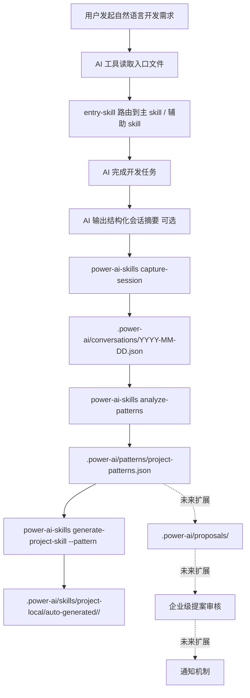
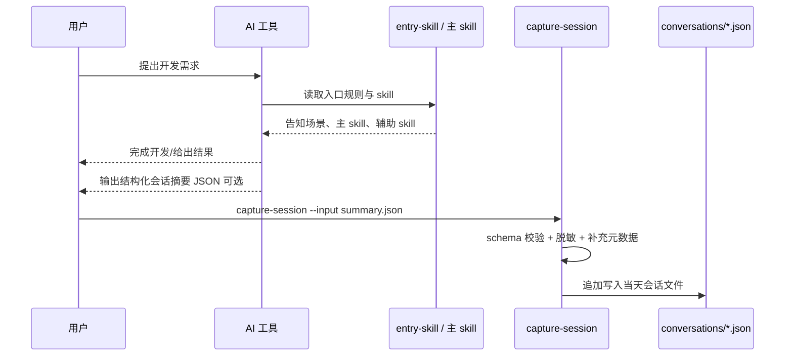
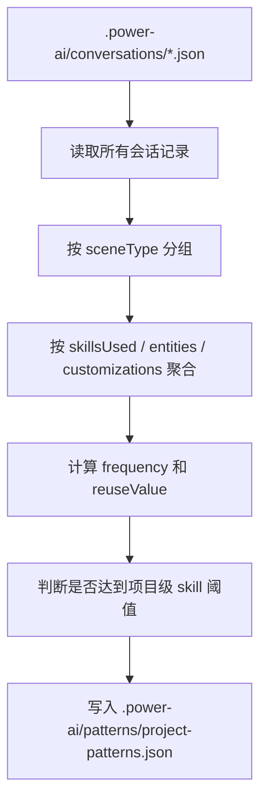
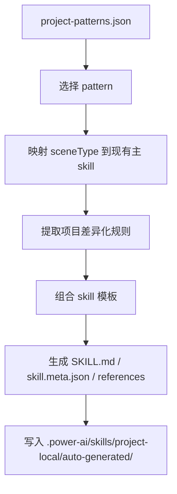
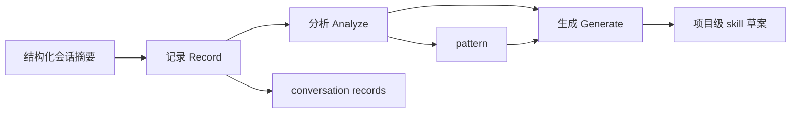
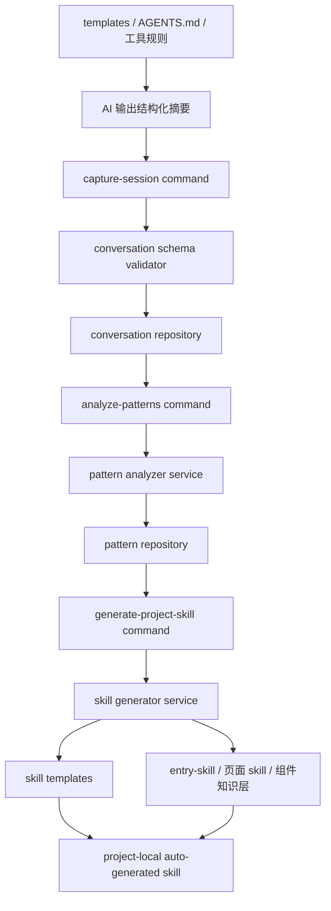
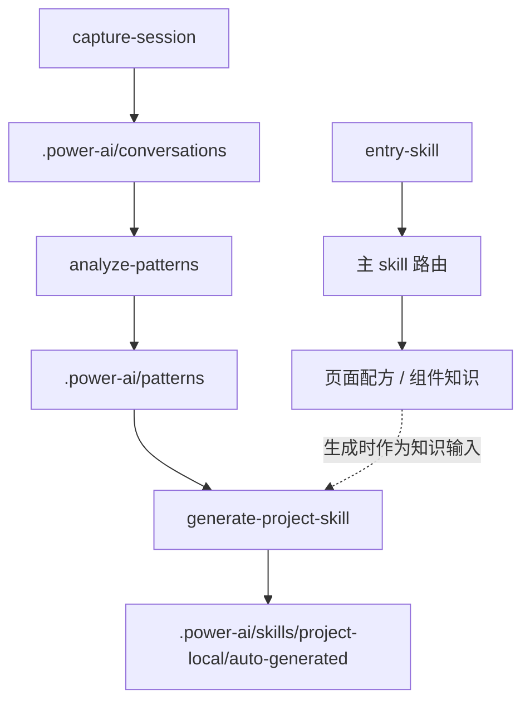

# 对话挖掘与项目级 Skill 沉淀方案

> 版本：1.1.0  
> 日期：2026-03-13  
> 状态：建议采用  
> 说明：本版本替代 `conversation-miner-skill-design-1.0.0.md` 的核心实现思路，保留后续企业级扩展入口，但首版只聚焦当前项目可稳定落地的能力。

---

## 1. 文档目标

这份文档要解决两个问题：

1. 说明这套“对话挖掘”能力在当前 `power-ai-skills` 里到底能不能做。
2. 让开发人员看完后，能清楚知道“记录、分析、生成”分别由谁执行、如何执行、输入输出是什么、模块关系是什么。

这份文档不是概念提案，而是首版可落地设计。

---

## 2. 结论先行

### 2.1 当前项目可以实现什么

基于现有 `power-ai-skills` 架构，**可以稳定实现**：

- 会话摘要采集
- 本地模式分析
- 项目级 skill 草案生成
- 基于 `.power-ai/` 的本地持久化
- 基于 CLI 的分析和生成命令

### 2.2 当前项目不应直接实现什么

基于现有架构，**不建议首版直接实现**：

- 仅依赖 `AGENTS.md` / 入口文件，在“每次对话结束时自动写入记录”
- 企业级跨项目提案审核流
- 邮件 / webhook / 管理员通知机制
- 平台级统一聚合服务

原因：

- 当前项目是本地 CLI + 模板分发工具，不是对话生命周期管理平台
- 不同 AI 工具没有统一、可靠的“对话结束钩子”
- 仅靠 prompt 约束 AI 自动写 `.power-ai/conversations/*.json`，数据一致性无法保证

---

## 3. 核心思想

这套方案里有两类角色：

- `skill / 入口规则`
  负责让 AI 知道要如何总结、如何分类、如何提取关键信息

- `CLI / 脚本 / 本地服务`
  负责真正校验、落盘、分析、生成

所以“记录、分析、生成”不是都交给 skill 完成，而是：

- 记录：`AI 负责总结`，`CLI 负责写入`
- 分析：`CLI 负责聚合和统计`
- 生成：`CLI 负责套模板生成草案`，必要时再引用 skill 知识层

一句话：

**skill 负责认知约束，CLI 负责稳定执行。**

---

## 4. 整体架构图



---

## 5. 三条执行链路

## 5.1 记录链路

### 5.1.1 目标

把一次有效开发会话沉淀为结构化摘要，而不是保存完整聊天记录。

### 5.1.2 执行者分工

- `入口规则 / skill`
  负责提示 AI 在开发结束后输出结构化摘要

- `capture-session` 命令
  负责校验、脱敏、追加写入会话文件

### 5.1.3 记录链路图



### 5.1.4 工作原理

1. 用户完成一次开发对话。
2. AI 根据入口规则，输出一份结构化摘要。
3. 开发者执行 `capture-session`，把摘要作为输入传给 CLI。
4. CLI 做以下处理：
   - 校验字段
   - 过滤敏感内容
   - 补充时间、工具名、记录 ID
   - 追加写入 `.power-ai/conversations/{date}.json`

### 5.1.5 为什么不直接让 AI 自动写文件

因为当前架构没有可靠的对话结束钩子。  
入口文件只能提高 AI“愿意输出摘要”的概率，不能保证：

- 每次都触发
- 格式都正确
- 一定成功写文件
- 所有工具行为一致

所以首版必须把“落盘”收口到命令。

### 5.1.6 输入与输出

输入：

- 一个结构化摘要 JSON 文件

输出：

- `.power-ai/conversations/{YYYY-MM-DD}.json`

### 5.1.7 建议命令

```bash
power-ai-skills capture-session --input .power-ai/tmp/session-summary.json
```

可扩展：

```bash
power-ai-skills capture-session --input summary.json --tool cursor
power-ai-skills capture-session --input summary.json --append-generated-files
```

---

## 5.2 分析链路

### 5.2.1 目标

从多条会话摘要中识别项目内高频模式，判断哪些场景值得沉淀为项目级 skill。

### 5.2.2 执行者分工

- `AI / skill`
  不参与真正分析，只提供前一步的结构化摘要原料

- `analyze-patterns` 命令
  负责读取历史记录、聚合、评分和输出模式结果

### 5.2.3 分析链路图



### 5.2.4 工作原理

`analyze-patterns` 读取 `conversations/` 下所有或指定时间范围内的会话记录，然后：

1. 按 `sceneType` 分组
2. 对每组统计：
   - 高频 skill 组合
   - 高频业务对象
   - 高频操作
   - 高频定制点
3. 根据阈值计算哪些 pattern 值得生成项目级 skill
4. 输出 `project-patterns.json`

### 5.2.5 分析不是 AI 做的原因

这一步本质上是稳定统计逻辑，不适合交给 AI 每次现算。  
如果交给 AI，会出现：

- 同一批数据多次分析结果不一致
- 阈值无法稳定执行
- 后续难以测试和校验

所以分析必须由程序执行。

### 5.2.6 输入与输出

输入：

- `.power-ai/conversations/*.json`

输出：

- `.power-ai/patterns/project-patterns.json`

### 5.2.7 建议命令

```bash
power-ai-skills analyze-patterns
power-ai-skills analyze-patterns --from 2026-03-01 --to 2026-03-13
```

---

## 5.3 生成链路

### 5.3.1 目标

把高频 pattern 生成项目级 skill 草案，用于后续复用。

### 5.3.2 执行者分工

- `pattern 数据`
  提供生成依据

- `generate-project-skill`
  负责映射主 skill、套模板、写出项目级 skill 草案

- `企业公共 skill / 页面配方 / 组件知识层`
  作为生成时的知识底座

### 5.3.3 生成链路图



### 5.3.4 工作原理

1. 读取某个 pattern。
2. 判断它属于哪个已有主 skill，例如：
   - `tree-list-page`
   - `basic-list-page`
3. 从 pattern 中提取项目差异化部分：
   - 高频业务对象
   - 高频操作
   - 高频自定义点
4. 生成项目级 skill 草案。

### 5.3.5 生成逻辑不是“AI 自己即兴写”

这一步必须是模板驱动，而不是“让 AI 再生成一套 skill”。  
原因：

- 模板生成更稳定
- 目录结构更统一
- 便于测试和回归
- 后续更容易接入审批流

### 5.3.6 输入与输出

输入：

- `project-patterns.json` 中的某个 pattern
- 现有企业公共 skill
- 组件知识和页面配方

输出：

- `.power-ai/skills/project-local/auto-generated/<skill-name>/`

### 5.3.7 建议命令

```bash
power-ai-skills generate-project-skill --pattern pattern_001
```

---

## 6. 三者的直接关系

这三步不是并列孤立关系，而是前后依赖关系：



解释：

- 没有“记录”，就没有后续可分析数据
- 没有“分析”，就无法稳定判断哪些会话值得沉淀
- 没有“生成”，分析结果就停留在报告层，没有形成复用资产

---

## 7. 模块关系图

## 7.1 运行模块关系



## 7.2 与现有项目模块的关系



---

## 8. 首版能力边界

## 8.1 In Scope

- 结构化会话摘要格式
- `.power-ai/conversations/` 本地存储
- `.power-ai/patterns/project-patterns.json`
- `.power-ai/skills/project-local/auto-generated/`
- 模式分析命令
- 项目级 skill 草案生成命令
- 可选的入口文件提示文案

## 8.2 Out of Scope

- 企业级提案审批
- 邮件 / webhook 通知
- 跨项目模式归并
- 平台管理端
- 自动修改企业公共 skill 仓库

---

## 9. 目录设计

首版建议新增以下目录：

```text
.power-ai/
  conversations/
    2026-03-13.json
  patterns/
    project-patterns.json
  skills/
    project-local/
      auto-generated/
  proposals/
    README.md
  notifications/
    README.md
```

说明：

- `conversations/`：首版真实启用
- `patterns/`：首版真实启用
- `skills/project-local/auto-generated/`：首版真实启用
- `proposals/`：首版只预留目录，不生成业务数据
- `notifications/`：首版只预留目录，不启用通知逻辑

这样做的目的，是为后续企业级提案和通知机制保留稳定入口，但不把复杂度一次性引入。

---

## 10. 数据结构设计

## 10.1 会话摘要

存储路径：

```text
.power-ai/conversations/{YYYY-MM-DD}.json
```

建议结构：

```json
{
  "date": "2026-03-13",
  "records": [
    {
      "id": "conv_20260313_001",
      "timestamp": "2026-03-13T10:30:00+08:00",
      "toolUsed": "cursor",
      "sceneType": "tree-list-page",
      "userIntent": "部门用户管理页面，左侧部门树，右侧用户列表，支持新增编辑删除",
      "skillsUsed": [
        "tree-list-page",
        "dialog-skill",
        "api-skill",
        "message-skill",
        "form-skill"
      ],
      "entities": {
        "mainObject": "用户",
        "treeObject": "部门",
        "operations": ["新增", "编辑", "删除", "查看"]
      },
      "generatedFiles": [
        "src/views/department-user/index.vue",
        "src/api/department-user.ts"
      ],
      "customizations": [
        "树节点点击后刷新列表",
        "弹窗表单维护用户信息"
      ],
      "complexity": "medium",
      "sensitiveDataFiltered": true,
      "source": "manual-summary"
    }
  ]
}
```

## 10.2 项目模式分析结果

存储路径：

```text
.power-ai/patterns/project-patterns.json
```

建议结构：

```json
{
  "projectName": "my-project",
  "lastAnalyzed": "2026-03-13T18:00:00+08:00",
  "patterns": [
    {
      "id": "pattern_001",
      "sceneType": "tree-list-page",
      "frequency": 7,
      "commonSkills": [
        "tree-list-page",
        "dialog-skill",
        "api-skill",
        "message-skill"
      ],
      "mainObjects": ["用户", "成员"],
      "treeObjects": ["部门", "组织"],
      "operations": ["新增", "编辑", "删除"],
      "customizations": [
        "树节点联动列表刷新",
        "弹窗表单维护"
      ],
      "reuseValue": "high",
      "recommendation": "建议生成项目级 skill"
    }
  ]
}
```

## 10.3 预留的企业级提案结构

首版不实现，但预留格式：

```text
.power-ai/proposals/{proposal-id}.json
```

建议结构：

```json
{
  "id": "proposal_20260313_001",
  "status": "reserved",
  "sourceType": "project-pattern",
  "patternId": "pattern_001",
  "scope": "enterprise",
  "reviewState": "not-enabled"
}
```

这个结构的价值不是现在就用，而是保证未来企业级能力上线时，不需要重改目录协议。

---

## 11. 命令设计

## 11.1 `capture-session`

用途：

- 接收结构化摘要输入
- 追加到 `.power-ai/conversations/{date}.json`
- 做字段校验与脱敏处理

建议命令：

```bash
power-ai-skills capture-session --input .power-ai/tmp/session-summary.json
```

可扩展参数：

```bash
power-ai-skills capture-session --input summary.json --tool cursor
power-ai-skills capture-session --input summary.json --append-generated-files
```

## 11.2 `analyze-patterns`

用途：

- 扫描 `conversations/`
- 聚合模式
- 输出 `project-patterns.json`

建议命令：

```bash
power-ai-skills analyze-patterns
power-ai-skills analyze-patterns --from 2026-03-01 --to 2026-03-13
```

## 11.3 `generate-project-skill`

用途：

- 根据 pattern 生成项目级 skill 草案
- 输出到 `.power-ai/skills/project-local/auto-generated/`

建议命令：

```bash
power-ai-skills generate-project-skill --pattern pattern_001
```

## 11.4 预留命令

首版不实现，但命名先预留：

```bash
power-ai-skills list-proposals
power-ai-skills approve-proposal --id proposal_001
power-ai-skills reject-proposal --id proposal_001
```

---

## 12. 入口文件改造建议

## 12.1 不再写“每次对话结束必须自动记日志”

建议把入口文件提示改成“可选输出结构化摘要”，而不是要求 AI 必须自动写文件。

推荐语义：

- 当一次开发任务完成后，可选输出结构化会话摘要
- 如果用户要求沉淀经验或生成项目级 skill，优先输出可供 `capture-session` 使用的 JSON 摘要
- 不记录完整会话，不记录敏感信息

## 12.2 占位符预留建议

可以在模板系统里预留新的占位符，但用途仅限“提示语”，不承担落盘逻辑。

建议新增：

- `POWER_AI_CAPTURE_HINT`

而不是：

- `POWER_AI_CONVERSATION_LOGGER`

原因是“logger”暗示系统具备自动记录能力，但当前并没有。

---

## 13. 生成逻辑设计

## 13.1 项目级 skill 生成目标

生成结果放到：

```text
.power-ai/skills/project-local/auto-generated/<skill-name>/
```

生成内容建议最小化：

- `SKILL.md`
- `skill.meta.json`
- `references/templates.md`

## 13.2 生成策略

项目级 skill 草案不是从零编造，而是基于：

- pattern 的 `sceneType`
- 高频 `skillsUsed`
- 高频 `entities`
- 高频 `customizations`
- 现有企业公共 skill

生成原则：

1. 优先复用已有企业公共 skill
2. 项目级 skill 只补项目差异化规则
3. 项目级 skill 不复制整个企业 skill 正文

---

## 14. 与未来企业级能力的衔接点

虽然首版不做企业级提案和通知，但建议现在就预留 4 个扩展点。

## 14.1 目录扩展点

- `.power-ai/proposals/`
- `.power-ai/notifications/`

## 14.2 数据扩展点

在 `project-patterns.json` 中保留这些可选字段：

- `enterpriseCandidate`
- `crossProjectHint`
- `proposalStatus`

## 14.3 命令扩展点

预留：

- `list-proposals`
- `show-proposal`
- `approve-proposal`
- `reject-proposal`

## 14.4 配置扩展点

建议预留配置文件名，但首版不强制生成：

```text
.power-ai/conversation-miner-config.json
.power-ai/notification-config.json
```

这样后续做企业级提案 + 通知机制时，可以直接扩展，而不用推翻首版目录协议。

---

## 15. 实施顺序

### Phase 1：会话采集

产出：

- `capture-session`
- conversation schema
- conversation 文件落盘

### Phase 2：模式分析

产出：

- `analyze-patterns`
- `project-patterns.json`
- 高频模式评分规则

### Phase 3：项目级 skill 草案生成

产出：

- `generate-project-skill`
- `project-local/auto-generated/`

### Phase 4：预留企业级接口

产出：

- `proposals/README.md`
- `notifications/README.md`
- 预留命令帮助和数据结构

注意：Phase 4 只是预留，不进入真实审核流实现。

---

## 16. 风险与控制

### 风险 1：误以为入口提示就能稳定采集

控制：

- 文档中明确写“入口提示不是强一致机制”
- 把真实落盘能力收口到 CLI 命令

### 风险 2：记录质量参差不齐

控制：

- 要求输入结构化摘要
- 做 schema 校验
- 默认脱敏

### 风险 3：生成大量低价值项目级 skill

控制：

- 只对达到阈值的 pattern 生成草案
- 生成前显示 pattern 摘要供确认

### 风险 4：过早引入企业级流程复杂度

控制：

- 首版不实现通知
- 首版不实现审批
- 仅保留预留目录和预留命令命名

---

## 17. 最终建议

建议采用本 1.1.0 方案，并按以下原则推进：

1. 首版只做项目内沉淀，不做企业级运营流
2. 首版以命令驱动采集为准，不依赖 AI 自动写文件
3. 入口文件只做辅助提示，不承担日志系统职责
4. 现在就预留 `proposals/`、`notifications/`、审批命令命名空间，为后续企业级提案 + 通知机制保留入口

一句话总结：

**把“对话挖掘”先做成一个稳定的本地分析与项目级沉淀工具，再在此基础上扩展企业级提案与通知能力。**
