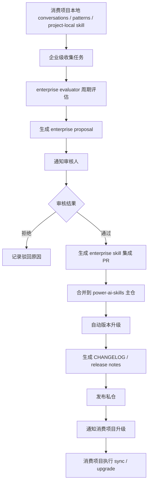
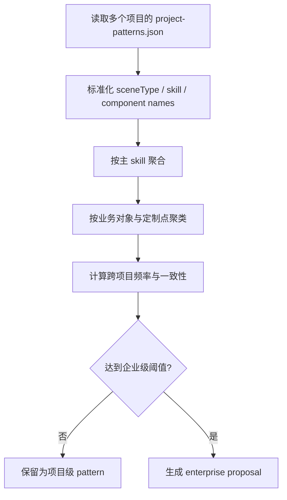
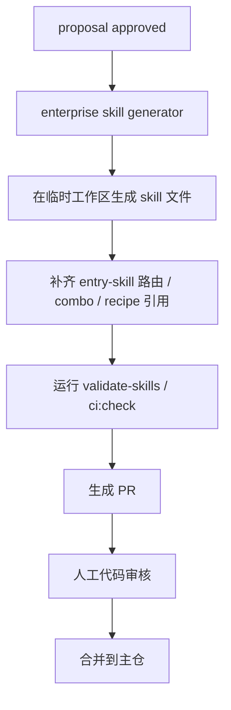
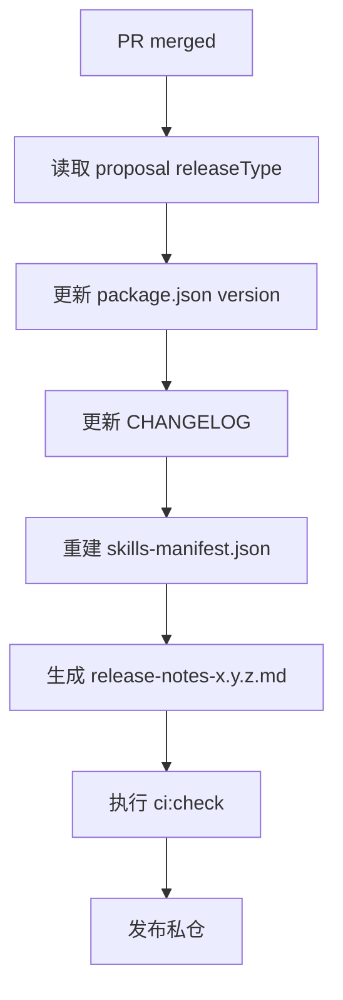

# 对话挖掘与企业级 Skill 升级方案

> 版本：1.2.0  
> 日期：2026-03-13  
> 状态：建议采用  
> 前置版本：`conversation-miner-skill-design-1.1.0.md`

---

## 1. 文档目标

这份文档解决的是 `1.1.0` 之后的下一步问题：

- 项目级 skill 已经能够被记录、分析、生成
- 接下来要解决“哪些项目级 skill 值得升级成企业级 skill”
- 企业级 skill 审核通过后，如何自动回流到 `power-ai-skills` 主仓
- 如何自动发起通知、审核、集成、发版、升级消费项目

这份方案的核心不是“如何做一个平台”，而是“如何在现有 `power-ai-skills` 工程基础上，把企业级沉淀流程自动化”。

---

## 2. 结论先行

首版企业级方案建议采用：

- `power-ai-skills` 继续作为**事实源仓库**
- 消费项目本地继续产出：
  - `conversations`
  - `project-patterns`
  - `project-local/auto-generated`
- 新增“企业级评估与提案流水线”：
  - 周期性收集多个项目的 pattern / project-local skill 元数据
  - 生成 enterprise proposal
  - 审核通过后自动生成 PR 回写到 `power-ai-skills`
  - PR 合并后自动完成版本升级、发布说明、私仓发包

**OpenClaw 可行，但不建议作为唯一可信执行器。**

更合理的定位是：

- OpenClaw：负责编排、触发、通知、辅助审核
- `power-ai-skills` 自身 CLI + CI：负责真实生成、校验、发版、升级

也就是说：

- 自动化主干应由**可测试、可复跑、可审计的脚本和 CI**承载
- OpenClaw 只作为“流程助理”或“自动化调度器”接入

这是当前最稳的方案。

---

## 3. 总体流程



---

## 4. 分层设计

## 4.1 项目级收集层

职责：

- 继续沿用 `1.1.0` 方案
- 在每个消费项目本地产出：
  - `.power-ai/conversations/*.json`
  - `.power-ai/patterns/project-patterns.json`
  - `.power-ai/skills/project-local/auto-generated/*`

这一层的目标是“先把单项目模式沉淀出来”。

## 4.2 企业级评估层

职责：

- 定期扫描多个项目的 `project-patterns`
- 判断哪些项目级模式具备企业复用价值
- 生成 `enterprise proposals`

这一层的目标是“把项目经验升级为企业候选能力”。

## 4.3 审核层

职责：

- 对 proposal 做人工或半自动审核
- 判断是否值得沉淀到企业公共 skill
- 审核通过后触发集成

这一层是企业治理边界，不能完全交给 AI 自己决定。

## 4.4 集成与发版层

职责：

- 根据审批通过的 proposal 自动生成 skill 文件
- 自动提交到 `power-ai-skills` 主仓
- 自动版本升级、变更记录、发包

这一层是工程自动化主链路。

---

## 5. 企业级收集的工作原理

## 5.1 输入来源

企业级评估不应该直接读取原始聊天内容，而应该读取已经结构化的产物：

1. 项目会话摘要  
2. 项目模式分析结果  
3. 项目级 skill 草案元数据  
4. 消费项目接入信息与命中统计

推荐输入源：

- `.power-ai/patterns/project-patterns.json`
- `.power-ai/skills/project-local/auto-generated/*/skill.meta.json`
- `.power-ai/selected-tools.json`

这样做的好处：

- 数据更稳定
- 不碰原始会话隐私
- 更容易做跨项目对比

## 5.2 企业级候选识别逻辑

可以按以下维度打分：

- 出现项目数
- 总出现频率
- 是否基于同一主 skill
- 是否复用同一组辅助 skill
- 是否具备稳定的数据契约
- 是否具备稳定的组件栈
- 是否包含通用定制点，而不是强业务耦合

建议阈值：

- 跨项目数 `>= 3`
- 总频率 `>= 15`
- 主 skill 一致度 `>= 80%`
- 组件栈一致度 `>= 80%`

如果满足阈值，进入 `enterprise proposal`。

---

## 6. 企业级评估流程



---

## 7. 提案数据结构

企业级提案建议存放在一个统一目录中，例如：

```text
enterprise/proposals/{proposal-id}.json
```

建议结构：

```json
{
  "id": "proposal_20260313_001",
  "createdAt": "2026-03-13T21:00:00+08:00",
  "status": "pending-review",
  "source": {
    "projects": ["project-a", "project-b", "project-c"],
    "totalOccurrences": 26,
    "crossProjectCount": 3
  },
  "baseSkill": "tree-list-page",
  "candidateSkill": {
    "name": "tree-list-with-status-toggle",
    "displayName": "带状态切换的树列表",
    "category": "ui",
    "description": "左树右表布局，列表支持行内状态切换",
    "secondarySkills": [
      "dialog-skill",
      "api-skill",
      "message-skill",
      "form-skill"
    ],
    "componentStack": {
      "page": "CommonLayoutContainer",
      "table": "pc-table-warp",
      "dialog": "pc-dialog"
    }
  },
  "review": {
    "requiredRoles": ["fe-arch-team", "ui-team"],
    "reviewedBy": [],
    "decision": null,
    "decisionReason": ""
  },
  "automation": {
    "pullRequestNumber": null,
    "targetBranch": "main",
    "releaseType": "minor"
  }
}
```

---

## 8. 审核流程设计

## 8.1 审核状态机

```mermaid
stateDiagram-v2
    [*] --> pending-review
    pending-review --> in-review
    in-review --> rejected
    in-review --> approved
    approved --> pr-generated
    pr-generated --> merged
    merged --> released
    rejected --> [*]
    released --> [*]
```

## 8.2 审核步骤

1. 提案生成后进入 `pending-review`
2. 通知审核人
3. 审核人查看 proposal：
   - 是否通用
   - 是否脱离具体业务耦合
   - 是否已有相似企业 skill
   - 是否符合企业组件规范
4. 审核通过后：
   - 自动生成 skill 集成 PR
   - PR 进入主仓代码审核
5. PR 合并后：
   - 自动版本升级
   - 自动生成 changelog/release notes
   - 自动发布私仓

## 8.3 审核不是可完全去人的环节

这一步不能全自动。  
原因：

- “是否企业通用”是治理判断，不是纯统计判断
- 需要防止把项目特有逻辑错误升级成企业规范

所以：

- 候选收集可以高度自动化
- 提案生成可以自动化
- 审核通知可以自动化
- 最终批准必须保留人工确认

---

## 9. 审核通过后如何回流到本项目

这一步是本方案的重点。

## 9.1 回流目标

审核通过的企业级 skill 必须回到 `power-ai-skills` 主仓，而不是停留在 proposal 文件里。

回流内容包括：

- `skills/<group>/<skill-name>/SKILL.md`
- `skills/<group>/<skill-name>/skill.meta.json`
- `skills/<group>/<skill-name>/references/*`
- 如果涉及入口路由：
  - `entry-skill/references/default-combos.md`
  - `entry-skill/references/routes.md`
  - `entry-skill/references/examples.md`
- 如果涉及组件知识：
  - `component-registry`
  - `page-recipes`

## 9.2 回流流程图



## 9.3 所需格式

为了实现自动集成，proposal 本身必须足够结构化，至少能提供：

- `baseSkill`
- `name`
- `displayName`
- `description`
- `secondarySkills`
- `componentStack`
- `common interactions`
- `sample intents`
- `releaseType`

也就是说，proposal 不能只是文字说明，必须是机器可消费的结构化 JSON。

---

## 10. 自动集成的实现方式

## 10.1 推荐实现：脚本 + PR 自动化

推荐用“脚本生成 + Git PR + CI 校验 + 合并发版”作为主路径。

具体做法：

1. 新增命令：
   - `collect-enterprise-patterns`
   - `generate-enterprise-proposal`
   - `approve-proposal`
   - `integrate-enterprise-skill`

2. `integrate-enterprise-skill` 做这些事：
   - 读取 proposal
   - 生成 skill 文件
   - 修改相关入口规则
   - 重建 manifest
   - 更新 changelog
   - 生成 release notes
   - 创建分支并提交
   - 推送并发起 PR

## 10.2 为什么推荐走 PR

因为企业级 skill 一旦进入主仓，就属于企业规范。  
必须具备：

- 变更可追溯
- 代码可审查
- 版本可回滚
- 发布可审计

如果直接自动写主分支，风险太高。

---

## 11. OpenClaw 是否可行

### 11.1 可行的部分

从 OpenClaw 官方说明看，它支持：

- 本地优先运行
- Webhooks / Cron jobs / Hooks
- 工具执行与自动化
- Skills 组织和工作区管理  
来源：
- OpenClaw 官方首页：<https://openclawlab.com/en/>
- OpenClaw Code Review Bot 文档：<https://openclawdoc.com/docs/cookbook/code-review-bot/>

官方首页明确提到它支持 `Automation`、`Webhooks`、`Cron jobs` 和 `Exec` 工具；Code Review Bot 示例也明确展示了通过 GitHub webhook 触发自动工作流并发送团队通知。基于这些信息，可以合理推断：

- 用 OpenClaw 做“定期扫描 proposal / 触发审核通知 / 触发集成命令”是可行的
- 用 OpenClaw 做“GitHub webhook 驱动的审批辅助流程”也是可行的

这是我基于官方文档做出的判断。

### 11.2 不建议让 OpenClaw 独自承担的部分

不建议让 OpenClaw 成为以下事项的唯一执行器：

- 直接修改 `power-ai-skills` 主仓主分支
- 跳过 PR 审查直接合并
- 自动发版时绕过 `ci:check`
- 独自决定 proposal 是否批准

原因：

- 这些环节需要强一致、可追溯、可回滚
- `power-ai-skills` 当前已有 CLI + CI，更适合作为事实执行器

### 11.3 最合理的定位

建议把 OpenClaw 定位成：

- `scheduler / notifier / orchestrator`

而不是：

- `source-of-truth release engine`

也就是说：

- OpenClaw 负责“触发”
- `power-ai-skills` CLI + CI 负责“真正执行”

---

## 12. 通知机制设计

## 12.1 通知触发条件

建议至少支持这几类通知：

1. 新 proposal 生成
2. proposal 即将超时未审
3. proposal 审核通过，已生成集成 PR
4. PR 合并，已发版
5. 消费项目可升级

## 12.2 通知渠道

建议按优先级分层：

- 首版必须支持：
  - 文件通知
  - 控制台输出
  - webhook

- 第二阶段可支持：
  - 企业微信 / 钉钉 / 飞书
  - 邮件

## 12.3 通知数据结构

建议目录：

```text
enterprise/notifications/{date}.json
```

建议结构：

```json
{
  "id": "notice_20260313_001",
  "type": "proposal-created",
  "createdAt": "2026-03-13T21:30:00+08:00",
  "proposalId": "proposal_20260313_001",
  "receivers": ["fe-arch-team", "ui-team"],
  "channels": ["webhook", "file"],
  "status": "sent"
}
```

## 12.4 通知内容模板

建议模板内容至少包含：

- proposal ID
- 候选 skill 名称
- 来源项目列表
- 出现频率
- 建议分类
- 审核入口
- PR 链接

---

## 13. 自动化版本升级

## 13.1 升级原则

企业级 skill 被正式集成后，必须触发版本升级。

建议规则：

- 新增企业级 skill：`minor`
- 仅调整文档或 metadata：`patch`
- 修改已有 skill 语义或路由：按影响评估 `minor/major`

## 13.2 升级自动化流程



## 13.3 升级实现建议

新增自动化命令：

- `release-from-proposal --id proposal_001`

这个命令负责：

- 读 proposal
- 决定版本级别
- 更新 `package.json`
- 更新 `CHANGELOG.md`
- 生成 release notes
- 执行发布前校验

---

## 14. 升级记录怎么做

升级记录必须至少落三类：

1. `CHANGELOG.md`
2. `manifest/release-notes-x.y.z.md`
3. proposal / notification 状态更新

## 14.1 CHANGELOG 记录建议

格式建议：

```md
## 1.3.0

- 新增企业级 skill：`tree-list-with-status-toggle`
- 来源项目：`project-a`、`project-b`、`project-c`
- 基于 `tree-list-page` 升级沉淀
- 自动生成并经人工审核后合入
```

## 14.2 proposal 状态回写

proposal 应同步更新：

- `status: released`
- `mergedPullRequest`
- `releasedVersion`
- `releasedAt`

这样后续可以追踪：

- 某个企业 skill 从哪个 proposal 来
- 由谁审批
- 在哪个版本发布

---

## 15. 自动化程度设计

## 15.1 可以高度自动化的部分

- 项目级 pattern 收集
- 企业级候选聚合
- proposal 文件生成
- 审核通知发送
- skill 文件模板生成
- PR 创建
- manifest / release notes 生成
- 发版后升级通知

## 15.2 不能建议全自动的部分

- proposal 最终批准
- 主仓 PR 最终合并
- 大版本升级决策

## 15.3 最佳实践

建议做成“90% 自动化 + 关键门禁人工确认”：

1. 自动收集
2. 自动生成 proposal
3. 自动通知
4. 人工审批
5. 自动生成 PR
6. 人工合并
7. 自动发版与通知

这比“完全自动 merge / 完全自动发版”更现实，也更适合企业规范治理。

---

## 16. 建议新增命令

建议在 `power-ai-skills` 或配套企业自动化仓库中新增：

```bash
power-ai-skills collect-enterprise-patterns
power-ai-skills generate-enterprise-proposal --pattern pattern_001
power-ai-skills list-proposals
power-ai-skills show-proposal --id proposal_001
power-ai-skills approve-proposal --id proposal_001
power-ai-skills reject-proposal --id proposal_001 --reason "已有相似 skill"
power-ai-skills integrate-enterprise-skill --id proposal_001
power-ai-skills release-from-proposal --id proposal_001
```

其中：

- `approve-proposal` 只改状态，不直接发版
- `integrate-enterprise-skill` 生成 PR
- `release-from-proposal` 在合并后执行版本升级和发布

---

## 17. 推荐落地架构

## 17.1 事实执行器

推荐：

- `power-ai-skills` CLI
- Git 仓库
- CI 流水线

## 17.2 编排器

可选：

- OpenClaw
- GitHub Actions scheduler
- Jenkins / 企业内部调度平台

## 17.3 推荐组合

最稳方案：

- GitHub Actions / 企业调度平台：定时触发
- `power-ai-skills` CLI：生成 proposal / 集成 / 发版
- OpenClaw：通知、辅助审核、补充工作流编排

如果团队已经在用 OpenClaw，可以让它承担：

- webhook 接收
- cron 调度
- 通知派发
- 审核提醒

但**不要让它成为唯一事实源**。

---

## 18. 分阶段实施建议

### Phase 1：企业级候选收集

产出：

- `collect-enterprise-patterns`
- enterprise proposal schema
- proposal 存储目录

### Phase 2：审核与通知

产出：

- `approve-proposal` / `reject-proposal`
- 文件通知 + webhook 通知
- proposal 状态机

### Phase 3：自动集成

产出：

- `integrate-enterprise-skill`
- 自动生成 PR
- 自动补充 skill / routes / combos / manifest

### Phase 4：自动发版与升级通知

产出：

- `release-from-proposal`
- 自动更新 `CHANGELOG`
- 自动生成 release notes
- 自动发私仓
- 自动通知消费项目升级

---

## 19. 最终建议

建议采用本 `1.2.0` 方案，并按以下原则推进：

1. 项目级沉淀继续以 `1.1.0` 为基础
2. 企业级升级必须走 proposal + review + PR + release 链路
3. 自动化尽量覆盖收集、生成、通知、集成、发版
4. 审批和合并保留人工门禁
5. OpenClaw 可以接入，但只作为编排器和通知器，不作为唯一可信发布引擎

一句话总结：

**项目级 skill 自动沉淀，企业级 skill 自动候选、人工批准、自动集成、自动发版。**
