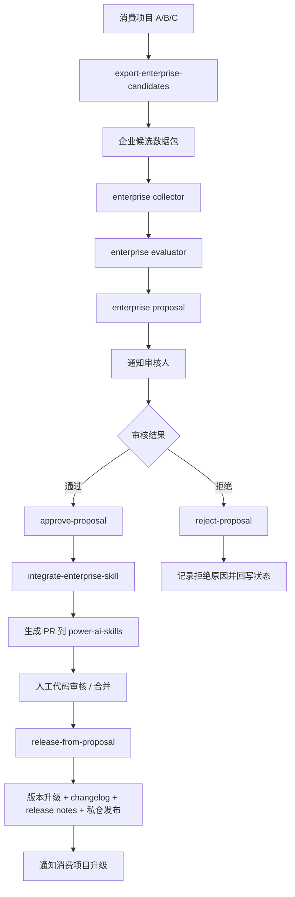
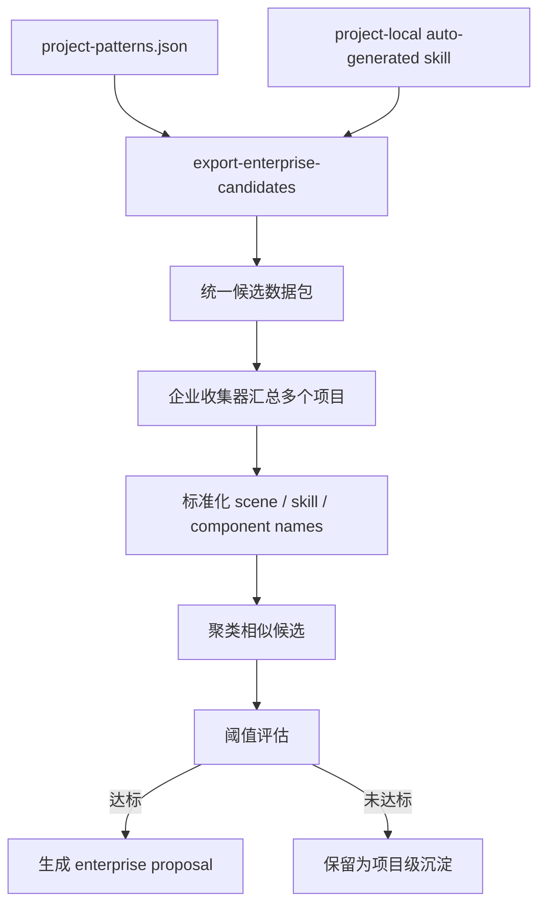
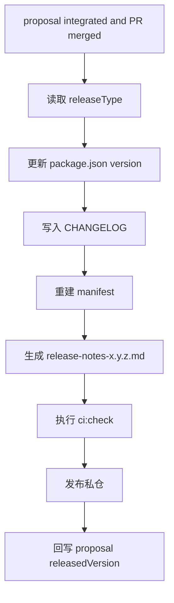

# 对话挖掘与企业级 Skill 升级开发任务拆解

> 版本：1.2.0  
> 日期：2026-03-13  
> 对应方案：`conversation-miner-skill-design-1.2.0.md`  
> 目标：把“项目级 skill 如何升级为企业级 skill”拆成可执行的开发任务与自动化链路

---

## 1. 这份文档解决什么问题

上一版 `1.2.0` 方案已经说明了企业级方向，但还不够“工程化落地”。  
这份拆解文档专门回答 5 个问题：

1. 项目级 skill 是怎么变成企业级候选的
2. 企业级候选是怎么发通知进入审核的
3. 审核通过后系统怎么接收，并自动添加到 `power-ai-skills`
4. 审核拒绝后系统应该怎么处理
5. 哪些步骤可以自动化，哪些步骤必须保留人工门禁

---

## 2. 先给最终结论

建议把整条链路拆成 7 步：

1. 各消费项目本地产生 `project-patterns` 和 `project-local auto-generated skill`
2. 消费项目导出“企业级候选数据包”
3. 企业收集器统一收集多个项目的数据包
4. 企业评估器生成 `proposal`
5. 通知审核人并进入审核流
6. 审核通过后自动生成集成 PR 到 `power-ai-skills`
7. PR 合并后自动发版并通知消费项目升级

这 7 步里：

- `1~4` 可以高度自动化
- `5` 审批必须人工确认
- `6~7` 可以半自动到高度自动化

---

## 3. 全链路总图



---

## 4. 项目级如何变成企业级

这是整条链路最关键的一步。

## 4.1 当前已有的项目级输入

消费项目已经能够逐步形成两类资产：

- `.power-ai/patterns/project-patterns.json`
- `.power-ai/skills/project-local/auto-generated/*`

但这些资产目前只存在于项目本地，企业仓库拿不到。  
所以要新增一个“导出候选数据包”的能力。

## 4.2 建议新增能力：导出候选数据包

建议在消费项目中新增命令：

```bash
power-ai-skills export-enterprise-candidates
```

作用：

- 读取当前项目的 `project-patterns.json`
- 读取 `project-local/auto-generated` 下的 skill 元数据
- 过滤掉明显不适合企业化的候选
- 输出一个统一格式的数据包

建议输出文件：

```text
.power-ai/reports/enterprise-candidates.json
```

## 4.3 候选数据包格式

建议结构：

```json
{
  "projectName": "power-factory-front",
  "projectVersion": "1.0.0",
  "generatedAt": "2026-03-13T21:00:00+08:00",
  "patterns": [
    {
      "patternId": "pattern_001",
      "sceneType": "tree-list-page",
      "frequency": 8,
      "commonSkills": [
        "tree-list-page",
        "dialog-skill",
        "api-skill",
        "message-skill"
      ],
      "componentStack": {
        "page": "CommonLayoutContainer",
        "table": "pc-table-warp",
        "dialog": "pc-dialog"
      },
      "entities": {
        "treeObject": ["部门"],
        "mainObject": ["用户"]
      },
      "customizations": [
        "树节点联动右表刷新",
        "行内状态切换"
      ],
      "candidateSkillName": "tree-list-with-status-toggle",
      "reuseValue": "high"
    }
  ],
  "projectLocalSkills": [
    {
      "name": "tree-list-with-status-toggle",
      "path": ".power-ai/skills/project-local/auto-generated/tree-list-with-status-toggle",
      "baseSkill": "tree-list-page",
      "status": "candidate"
    }
  ]
}
```

## 4.4 企业级评估器怎么把项目级变成企业级候选

企业评估器不是直接拿一个项目的 skill 就升级，而是：

1. 收集多个项目的数据包
2. 标准化字段
3. 找到“相似 pattern / 相似项目级 skill”
4. 判断它们是否具备企业复用价值
5. 达到阈值后生成 enterprise proposal

## 4.5 关键判断条件

建议最少满足：

- 跨项目数 `>= 3`
- 总出现次数 `>= 15`
- 主 skill 一致
- 组件栈一致
- 定制点一致度较高
- 业务对象可泛化，不是强项目耦合

## 4.6 项目级到企业级的转换图



---

## 5. 企业级 proposal 怎么发送通知

## 5.1 proposal 生成后触发通知

当企业评估器生成一个新的 proposal 后，不应该直接进入集成，而应该先进入审核状态：

- `status = pending-review`

此时自动触发通知。

## 5.2 通知发送机制

建议按两层做：

### 第一层：必须支持

- 文件通知
- webhook 通知

### 第二层：后续可扩展

- 企业微信
- 钉钉
- 飞书
- 邮件

## 5.3 通知实现方式

建议新增命令：

```bash
power-ai-skills notify-proposal --id proposal_001
```

它负责：

- 读取 proposal
- 渲染消息模板
- 发送到配置的 channel
- 记录通知状态

## 5.4 通知配置文件

建议放在企业自动化工作区中：

```text
enterprise/config/notification-config.json
```

示例：

```json
{
  "channels": {
    "file": {
      "enabled": true,
      "outputPath": "enterprise/notifications"
    },
    "webhook": {
      "enabled": true,
      "urls": [
        "https://internal-webhook.company.com/power-ai-skills"
      ]
    }
  },
  "receivers": {
    "fe-arch-team": ["arch-a", "arch-b"],
    "ui-team": ["ui-a"]
  }
}
```

## 5.5 通知内容模板

建议内容至少包含：

- proposal ID
- 候选 skill 名称
- 来源项目
- 出现频率
- 基于哪个主 skill
- 需要谁审核
- 审核入口或命令

---

## 6. 通知后怎么进行审核

## 6.1 审核入口

推荐两种方式：

### 方式一：CLI 审核

```bash
power-ai-skills show-proposal --id proposal_001
power-ai-skills approve-proposal --id proposal_001
power-ai-skills reject-proposal --id proposal_001 --reason "已有重复 skill"
```

### 方式二：OpenClaw / 平台卡片点击后回调

如果未来接入 OpenClaw 或内部平台：

- 点击“通过” -> 调用 `approve-proposal`
- 点击“拒绝” -> 调用 `reject-proposal`

所以平台只是 UI 层，真正状态变更仍然由 CLI/脚本执行。

## 6.2 审核状态变化

```mermaid
stateDiagram-v2
    [*] --> pending-review
    pending-review --> approved
    pending-review --> rejected
    approved --> integrated
    integrated --> released
    rejected --> closed
```

## 6.3 审核通过后系统怎么接受

审核通过后，不是直接发版，而是触发：

```bash
power-ai-skills integrate-enterprise-skill --id proposal_001
```

这个命令就是系统“接受”审批结果的入口。

它做 4 件事：

1. 读取 proposal
2. 校验 proposal 状态是 `approved`
3. 生成企业级 skill 集成改动
4. 创建 PR

---

## 7. 审核通过后怎么添加到 power-ai-skills

## 7.1 集成命令

核心命令建议是：

```bash
power-ai-skills integrate-enterprise-skill --id proposal_001
```

## 7.2 集成命令要做哪些事情

它必须自动完成以下动作：

### 1. 读取 proposal

确定：

- skill 名称
- skill 分类
- 主 skill
- 辅助 skill
- 组件栈
- 样例 intents
- releaseType

### 2. 生成企业级 skill 文件

在 `power-ai-skills` 主仓里生成：

```text
skills/ui/<skill-name>/
  SKILL.md
  skill.meta.json
  references/
    templates.md
```

### 3. 如果需要，自动补入口路由

修改：

- `skills/orchestration/entry-skill/references/routes.md`
- `skills/orchestration/entry-skill/references/default-combos.md`
- `skills/orchestration/entry-skill/references/examples.md`

### 4. 如果需要，自动补配方或组件知识引用

修改：

- `component-registry`
- `page-recipes`

### 5. 自动执行校验

至少执行：

- `validate-skills`
- `check-docs`
- `check-component-knowledge`
- `ci:check`

### 6. 自动创建分支和 PR

例如：

- 分支：`feat/proposal-20260313-001-tree-list-with-status-toggle`
- 自动提交 commit
- 自动推送
- 自动创建 PR

## 7.3 集成结果格式

集成成功后，proposal 要回写：

```json
{
  "status": "integrated",
  "integration": {
    "branch": "feat/proposal-20260313-001-tree-list-with-status-toggle",
    "pullRequestUrl": "https://git.company.com/power-ai-skills/pulls/123"
  }
}
```

---

## 8. 审核拒绝后该怎么做

这一步必须设计清楚，不然 proposal 会积压。

## 8.1 拒绝时要做的事

执行：

```bash
power-ai-skills reject-proposal --id proposal_001 --reason "已有同类企业级 skill"
```

系统要自动完成：

1. proposal 状态更新为 `rejected`
2. 记录拒绝原因
3. 记录审核人和时间
4. 发送拒绝通知
5. 如果有来源项目，回写“本次未升级为企业级”的结果

## 8.2 拒绝后的 proposal 结构

```json
{
  "status": "rejected",
  "review": {
    "decision": "rejected",
    "decisionReason": "已有同类企业级 skill",
    "reviewedBy": ["arch-a"],
    "reviewedAt": "2026-03-13T22:00:00+08:00"
  }
}
```

## 8.3 拒绝后是否完全丢弃

不建议直接删除 proposal。  
应该保留，用于：

- 后续再次评估
- 防止重复提交同类候选
- 统计哪些模式长期被拒绝

## 8.4 拒绝后的后续策略

建议分两类：

- `hard-rejected`
  - 明确不适合企业化
  - 后续相似候选需要更高阈值才重新提案

- `soft-rejected`
  - 当前信息不足或抽象不够
  - 允许后续累积更多项目和频率后再次提案

---

## 9. 版本升级怎么做

## 9.1 为什么要和 proposal 绑定

如果企业级 skill 是通过 proposal 引入的，那么版本升级也应该和 proposal 绑定，避免：

- 只知道版本变了，不知道为什么变
- 不知道某个 skill 是从哪个提案来的

## 9.2 版本升级命令

建议新增：

```bash
power-ai-skills release-from-proposal --id proposal_001
```

## 9.3 自动升级流程



## 9.4 版本规则建议

- 新增企业级 skill：`minor`
- 修复企业级 skill 细节：`patch`
- 破坏性调整已有 skill 路由或语义：`major`

---

## 10. 升级记录怎么做

## 10.1 CHANGELOG

自动追加：

```md
## 1.3.0

- 新增企业级 skill：`tree-list-with-status-toggle`
- 来源项目：`project-a`、`project-b`、`project-c`
- 基于 proposal：`proposal_20260313_001`
- 经审核通过后自动生成 PR 集成
```

## 10.2 release notes

自动生成：

- skill 名称
- 来源项目
- 升级原因
- 影响范围
- 消费项目升级建议

## 10.3 proposal 回写

proposal 必须同步写入：

- `releasedVersion`
- `releasedAt`
- `mergedPullRequest`

这样后续能从 proposal 反查到版本。

---

## 11. 自动化程度怎么设计

## 11.1 建议自动化覆盖范围

建议自动化这些步骤：

- 项目级候选导出
- 多项目候选收集
- 企业级 proposal 生成
- proposal 通知发送
- proposal 状态变更
- 企业级 skill 文件生成
- PR 创建
- 版本升级
- changelog / release notes 生成
- 私仓发布
- 升级通知

## 11.2 必须人工确认的步骤

不能建议全自动的：

- `approve-proposal`
- 主仓 PR 合并
- `major` 版本升级决策

## 11.3 推荐自动化比例

最合理的是：

- 90% 自动化
- 关键治理节点人工确认

也就是：

1. 自动收集
2. 自动提案
3. 自动通知
4. 人工审批
5. 自动集成
6. 人工合并
7. 自动发版
8. 自动通知升级

---

## 12. OpenClaw 在这条链路里的位置

## 12.1 适合 OpenClaw 做的

- 定时调度 `collect-enterprise-patterns`
- 监听 proposal 生成并触发通知
- 提供审核消息卡片
- 调用 `approve-proposal` / `reject-proposal`
- 合并后触发 `release-from-proposal`

## 12.2 不适合完全交给 OpenClaw 的

- 直接写 `power-ai-skills` 主分支
- 跳过 PR
- 绕过 `ci:check`
- 单独决定企业级 skill 是否批准

## 12.3 最佳定位

OpenClaw 适合作为：

- orchestrator
- notifier
- scheduler

而不是：

- source-of-truth execution engine

真正的事实执行器仍应该是：

- `power-ai-skills` CLI
- Git PR
- CI

---

## 13. 建议新增命令清单

消费项目侧：

```bash
power-ai-skills export-enterprise-candidates
```

企业收集 / 审核侧：

```bash
power-ai-skills collect-enterprise-patterns
power-ai-skills generate-enterprise-proposal --pattern pattern_001
power-ai-skills show-proposal --id proposal_001
power-ai-skills approve-proposal --id proposal_001
power-ai-skills reject-proposal --id proposal_001 --reason "已有重复 skill"
power-ai-skills notify-proposal --id proposal_001
power-ai-skills integrate-enterprise-skill --id proposal_001
power-ai-skills release-from-proposal --id proposal_001
```

---

## 14. 开发任务拆解

## Phase 1：项目级候选导出

目标：

- 把消费项目中的项目级成果导出成标准化候选包

任务：

1. 新增 `export-enterprise-candidates`
2. 定义 `enterprise-candidates.schema.json`
3. 输出 `.power-ai/reports/enterprise-candidates.json`

验收：

- 单项目可稳定导出候选数据包

## Phase 2：企业级候选收集与 proposal 生成

目标：

- 把多个项目的候选合并并生成 proposal

任务：

1. 新增 `collect-enterprise-patterns`
2. 新增 `generate-enterprise-proposal`
3. 定义 `proposal.schema.json`

验收：

- 能从多个项目导出包中生成 `proposal`

## Phase 3：通知与审核

目标：

- proposal 生成后可通知并进入审核流

任务：

1. 新增 `notify-proposal`
2. 新增 `show-proposal`
3. 新增 `approve-proposal`
4. 新增 `reject-proposal`
5. 增加 `notification-config.json`

验收：

- proposal 状态可流转
- 通知可发送

## Phase 4：自动集成

目标：

- 审核通过后自动生成 skill PR

任务：

1. 新增 `integrate-enterprise-skill`
2. 生成 skill 目录和入口路由改动
3. 自动执行校验
4. 自动创建 PR

验收：

- proposal 通过后能自动产出 PR

## Phase 5：自动发版与升级通知

目标：

- PR 合并后自动版本升级和发版

任务：

1. 新增 `release-from-proposal`
2. 自动改版本号
3. 自动写 changelog
4. 自动生成 release notes
5. 自动发布私仓
6. 自动通知消费项目升级

验收：

- proposal 能贯通到正式版本发布

---

## 15. 最终建议

如果你要把这条链路做成高度自动化，我建议按下面的治理原则落地：

1. 项目级 -> 企业级，必须靠“导出候选包 + 跨项目评估”，而不是人工复制 skill
2. 通知必须自动发，但审批必须保留人工确认
3. 审批通过后，系统接受结果的唯一入口应该是 `integrate-enterprise-skill`
4. 审批拒绝后不删除 proposal，而是保留原因并允许后续重评
5. 企业级 skill 回流到 `power-ai-skills` 时，必须走 PR、校验、发版链路
6. OpenClaw 可以深度接入，但只负责编排和通知，不替代 CLI + Git + CI

一句话总结：

**项目级 skill 自动导出候选，企业级自动聚合提案，人工审核后自动集成、自动发版、自动通知。**
