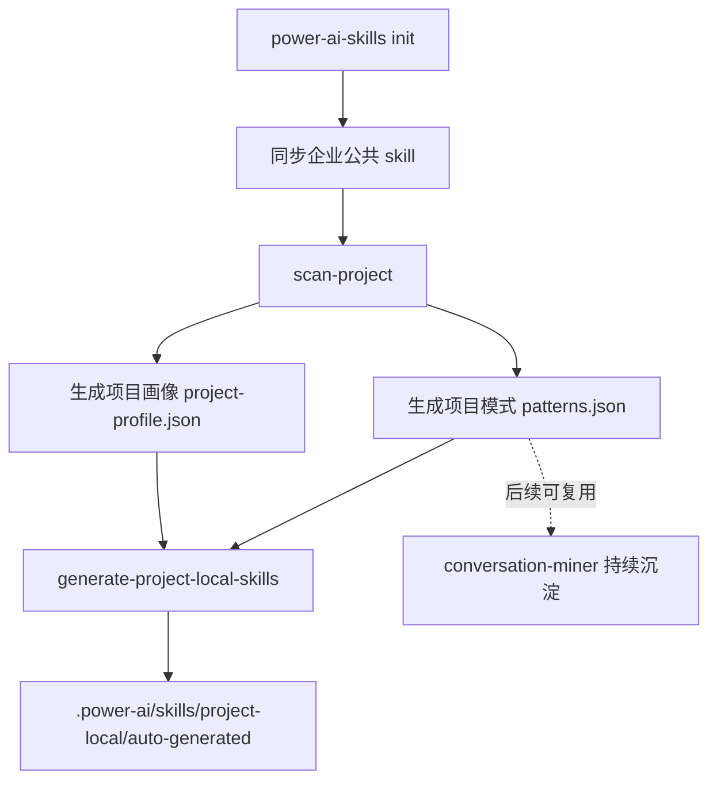
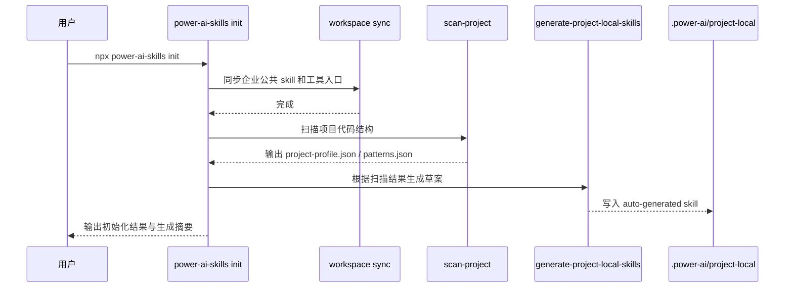
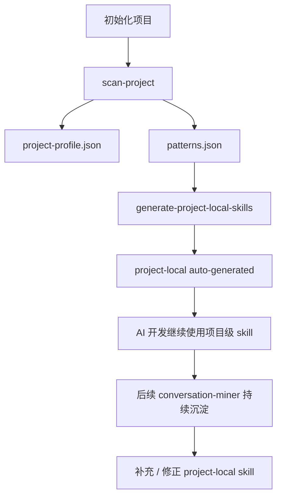

# 项目初始化自动扫描与 Project-Local Skill 冷启动方案

> 版本：1.0.3  
> 日期：2026-03-13  
> 状态：建议采用  
> 目标：解决消费项目执行 `init` 后 `.power-ai/skills/project-local/` 为空的问题

---

## 1. 背景

当前 `power-ai-skills` 在消费项目执行 `init` / `sync` 后，会完成以下事情：

- 同步企业公共 skill 到 `.power-ai/skills/`
- 生成工具入口文件
- 生成 `.power-ai/tool-registry.json`、`.power-ai/team-defaults.json`、`.power-ai/template-registry.json`
- 确保 `.power-ai/skills/project-local/` 目录存在

但现在有一个明显问题：

- `project-local` 目录虽然存在，但初始化后是空的
- 项目一开始没有任何项目私有 skill
- AI 在冷启动阶段只能依赖企业公共 skill，无法利用项目既有代码模式

这会导致两个后果：

1. 项目已有的页面骨架、组件习惯、接口组织方式没有被吸收
2. 后续即使要做“对话挖掘与项目级 skill 沉淀”，在冷启动阶段也没有基础项目画像

因此 `1.0.3` 的核心目标是：

**在项目初始化时，先自动扫描一次项目代码，生成第一批项目级 skill 草案，填充 `project-local`，作为项目冷启动知识层。**

---

## 2. 结论先行

`1.0.3` 建议新增一条“冷启动扫描链路”：

```text
init
  -> sync 企业公共 skill
  -> scan-project 扫描项目
  -> generate-project-local-skills 生成项目级 skill 草案
  -> 写入 .power-ai/skills/project-local/auto-generated/
```

这条链路的定位不是“完全替代后续对话挖掘”，而是：

- `项目扫描`：解决初始化时 `project-local` 为空
- `对话挖掘`：解决后续持续沉淀和演进

两者关系是：

**项目扫描负责冷启动，对话挖掘负责持续优化。**

---

## 3. 设计目标

`1.0.3` 只解决冷启动问题，不引入企业级 proposal、通知、审核等治理复杂度。

首版目标：

1. 初始化时自动扫描项目现有代码结构
2. 识别高频页面模式和企业组件使用模式
3. 生成一批项目级 skill 草案
4. 将草案放入 `.power-ai/skills/project-local/auto-generated/`
5. 为后续对话挖掘保留分析结果和项目画像

不在 `1.0.3` 范围内的内容：

- 企业级 skill 提案
- 审核流
- 通知机制
- 跨项目聚合

---

## 4. 核心思路

这套能力不应该靠 AI 直接遍历整个项目然后自由发挥生成 skill。  
更稳的方式是两段式：

1. **扫描阶段**
   由脚本扫描项目，提取稳定事实。

2. **生成阶段**
   根据扫描结果套模板生成项目级 skill 草案。

这样能保证：

- 结果稳定
- 可重复执行
- 可测试
- 不依赖 AI 当场理解整个项目

---

## 5. 总体架构



---

## 6. 执行链路

## 6.1 初始化链路

建议 `init` 流程扩展为：



## 6.2 可选行为控制

建议支持这些开关：

```bash
power-ai-skills init --no-project-scan
power-ai-skills init --project-scan-only
power-ai-skills init --regenerate-project-local
```

含义：

- `--no-project-scan`
  只做原有初始化，不扫描项目

- `--project-scan-only`
  不重复初始化工具入口，只做扫描和草案生成

- `--regenerate-project-local`
  强制覆盖重新生成 `auto-generated`

---

## 7. 目录设计

建议新增这些目录和文件：

```text
.power-ai/
  analysis/
    project-profile.json
    patterns.json
  skills/
    project-local/
      README.md
      auto-generated/
        basic-list-page-project/
        tree-list-page-project/
```

说明：

- `analysis/project-profile.json`
  保存项目结构画像

- `analysis/patterns.json`
  保存扫描阶段识别出的模式

- `skills/project-local/auto-generated/`
  保存自动生成的项目级 skill 草案

这样后续你做 `conversation-miner` 时，可以直接复用：

- `project-profile.json`
- `patterns.json`

而不用从零开始。

---

## 8. 扫描阶段设计

## 8.1 scan-project 的职责

`scan-project` 负责从现有项目中提取可结构化的稳定事实。

它不负责：

- 直接生成 skill
- 修改业务代码
- 推测业务含义过深的领域规则

它只负责提取事实。

## 8.2 扫描输入

扫描输入主要来自项目源码目录，例如：

- `src/views/`
- `src/api/`
- `src/router/`
- `src/components/`
- `src/store/`
- `src/utils/`

## 8.3 扫描输出

建议输出两个文件：

### 1. 项目画像

```text
.power-ai/analysis/project-profile.json
```

### 2. 模式识别结果

```text
.power-ai/analysis/patterns.json
```

---

## 9. 项目画像设计

## 9.1 project-profile.json 作用

用于描述这个项目的整体技术和结构特征，例如：

- 主视图目录
- API 目录
- 路由组织方式
- 高频使用的企业组件
- 页面骨架习惯
- 常见模块划分

## 9.2 推荐结构

```json
{
  "projectName": "power-factory-front",
  "generatedAt": "2026-03-13T20:00:00+08:00",
  "structure": {
    "viewsRoot": "src/views",
    "apiRoot": "src/api",
    "routerRoot": "src/router"
  },
  "frameworkSignals": {
    "vue": true,
    "pinia": true,
    "powerRuntime": true,
    "powerComponents": true
  },
  "componentUsage": {
    "CommonLayoutContainer": 6,
    "pc-table-warp": 14,
    "pc-dialog": 10,
    "PcContainer": 8,
    "PcTree": 3
  },
  "pagePatterns": {
    "basicListPage": 12,
    "treeListPage": 3,
    "detailPage": 4,
    "dialogFormCrud": 7
  }
}
```

---

## 10. 模式识别结果设计

## 10.1 patterns.json 作用

记录“这个项目里已经存在哪些高频页面模式”。

## 10.2 推荐结构

```json
{
  "generatedAt": "2026-03-13T20:00:00+08:00",
  "patterns": [
    {
      "id": "pattern_basic_list_crud",
      "type": "basic-list-page",
      "frequency": 12,
      "files": [
        "src/views/user/index.vue",
        "src/views/role/index.vue"
      ],
      "componentStack": {
        "page": "PcContainer",
        "table": "pc-table-warp",
        "dialog": "pc-dialog"
      },
      "features": [
        "search-form",
        "table-crud",
        "dialog-form"
      ],
      "confidence": "high"
    },
    {
      "id": "pattern_tree_list_crud",
      "type": "tree-list-page",
      "frequency": 3,
      "files": [
        "src/views/department-user/index.vue"
      ],
      "componentStack": {
        "page": "CommonLayoutContainer",
        "table": "pc-table-warp",
        "dialog": "pc-dialog"
      },
      "features": [
        "left-tree-right-table",
        "tree-node-refresh-list",
        "dialog-form"
      ],
      "confidence": "high"
    }
  ]
}
```

---

## 11. 扫描规则

## 11.1 首版建议只做静态可判断模式

`1.0.3` 不要做过深语义分析，优先识别这些稳定模式：

- 标准列表 CRUD
- 树列表 CRUD
- 详情页
- 弹窗表单 CRUD

## 11.2 识别依据

可以通过以下静态信号判断：

### 标准列表页

- 使用 `pc-table-warp`
- 页面内有搜索表单 / 查询对象
- 有新增编辑删除按钮或方法

### 树列表页

- 使用 `CommonLayoutContainer`
- 或使用 `PcTree` + 右侧表格组合
- 有树节点点击刷新右表逻辑

### 弹窗表单 CRUD

- 使用 `pc-dialog`
- 存在表单模型
- 存在新增 / 编辑提交逻辑

### 详情页

- 只读表单或信息展示结构
- 明确有详情数据加载逻辑

## 11.3 首版不做的识别

不建议 `1.0.3` 首版就做：

- 复杂审批流
- 图表看板
- 上传导入导出复杂流
- 权限页

这些模式不够稳定，误判成本高。

---

## 12. 生成阶段设计

## 12.1 generate-project-local-skills 的职责

根据 `project-profile.json` 和 `patterns.json`，生成项目级 skill 草案。

## 12.2 输入

- `.power-ai/analysis/project-profile.json`
- `.power-ai/analysis/patterns.json`
- 企业公共 skill
- 页面配方
- 企业组件知识层

## 12.3 输出

写入：

```text
.power-ai/skills/project-local/auto-generated/
```

## 12.4 生成内容

建议每个草案最少包含：

```text
<skill-name>/
  SKILL.md
  skill.meta.json
  references/
    templates.md
```

## 12.5 草案状态

生成的 project-local skill 不应默认视为“正式人工确认规则”，而是应带草案属性。

建议在 `skill.meta.json` 加这些字段：

```json
{
  "status": "draft",
  "source": "project-scan",
  "confidence": "high"
}
```

这样后续可以区分：

- `source: project-scan`
- `source: conversation-miner`
- `source: manual`

---

## 13. 生成策略

## 13.1 不是从零生成，而是基于现有企业 skill 派生

例如：

- 识别到标准列表模式  
  -> 基于 `basic-list-page` 生成项目级 skill

- 识别到树列表模式  
  -> 基于 `tree-list-page` 生成项目级 skill

生成内容应只补项目差异，不复制企业公共 skill 全文。

## 13.2 建议生成的首批项目级 skill

建议 `1.0.3` 首版最多生成 4 类：

1. `basic-list-page-project`
2. `tree-list-page-project`
3. `dialog-form-project`
4. `detail-page-project`

目的是先验证链路，不要一开始就把项目拆成很多细 skill。

---

## 14. 与后续对话挖掘的关系

这是你这次想法里最重要的点。

## 14.1 两者分工

### 项目扫描

负责：

- 初始化时补齐项目冷启动知识
- 把现有代码模式转成第一批项目级草案

### 对话挖掘

负责：

- 初始化后持续沉淀新需求和新模式
- 修正或扩展已有草案
- 逐步提高 project-local 的覆盖度

## 14.2 衔接关系图



## 14.3 为什么这比只做 conversation-miner 更合理

因为如果不做冷启动扫描：

- 初始化时 `project-local` 为空
- 对话挖掘只能从未来会话开始积累
- 老项目已有经验无法立刻利用

而加入扫描后：

- 老项目的历史代码经验能立即转为草案
- 后续对话挖掘是在已有基础上继续补充

---

## 15. 新增命令设计

建议新增两个命令：

```bash
power-ai-skills scan-project
power-ai-skills generate-project-local-skills
```

### 15.1 scan-project

作用：

- 扫描项目
- 输出 `project-profile.json`
- 输出 `patterns.json`

### 15.2 generate-project-local-skills

作用：

- 根据扫描结果生成草案
- 输出到 `project-local/auto-generated/`

### 15.3 init 默认行为

建议默认：

```bash
power-ai-skills init
```

内部等价于：

```bash
power-ai-skills sync
power-ai-skills scan-project
power-ai-skills generate-project-local-skills
```

---

## 16. 开关与兼容性

建议新增这些参数：

```bash
--no-project-scan
--project-scan-only
--regenerate-project-local
```

用途：

- 保持兼容，允许项目只使用旧 init 行为
- 支持单独重跑扫描与草案生成

---

## 17. 自动化边界

## 17.1 可以自动化的部分

- 项目结构扫描
- 模式识别
- 项目画像生成
- 项目级 skill 草案生成
- init 默认串起来执行

## 17.2 不能完全自动化的部分

- 草案是否完全合理
- 草案命名是否最符合团队习惯
- 某些复杂业务模式是否值得抽成项目级 skill

所以生成结果应该被视为：

- `draft`
- 可继续被人工调整
- 可继续被对话挖掘增强

---

## 18. 推荐实施顺序

### Phase 1：项目扫描

产出：

- `scan-project`
- `project-profile.json`
- `patterns.json`

### Phase 2：草案生成

产出：

- `generate-project-local-skills`
- `project-local/auto-generated/`

### Phase 3：init 集成

产出：

- `init` 默认串行执行冷启动扫描
- CLI 参数开关

### Phase 4：与对话挖掘打通

产出：

- `project-scan` 和 `conversation-miner` 共用同一套 `analysis/` 目录和模式结构

---

## 19. 最终建议

建议 `1.0.3` 就做这件事，而且优先级很高。  
因为它能立刻解决一个真实体验问题：

**项目刚初始化时，`project-local` 不再是空目录，而是至少带着一批来自现有代码的项目级 skill 草案。**

这件事的价值非常直接：

- 提升冷启动效果
- 让 AI 一开始就有项目知识
- 给后续对话挖掘提供基础画像和模式结果

一句话总结：

**`1.0.3` 先做项目扫描冷启动，让 `project-local` 初始化即有内容；后续再用对话挖掘持续补强。**
